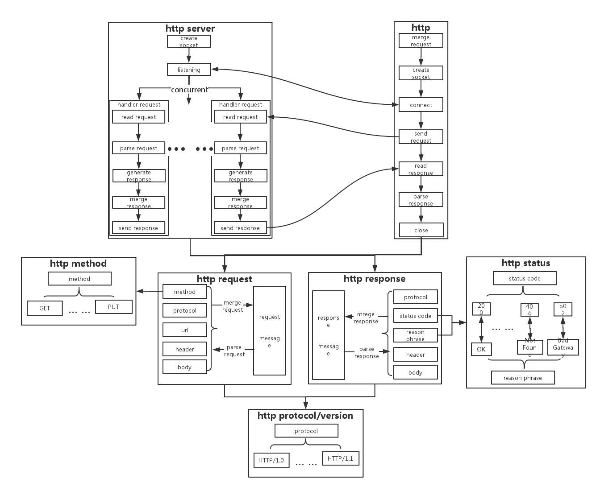

# A simple http server in c++.

## Usage

./http_server_main  <port>

./http_clent_main <request-url> <local-file>

eg:

./http_server_main 1024

./http_clent_main http://127.0.0.1:1024/index.html index.html

## Library
1.  Google Glog 0.3.4

## Framework

